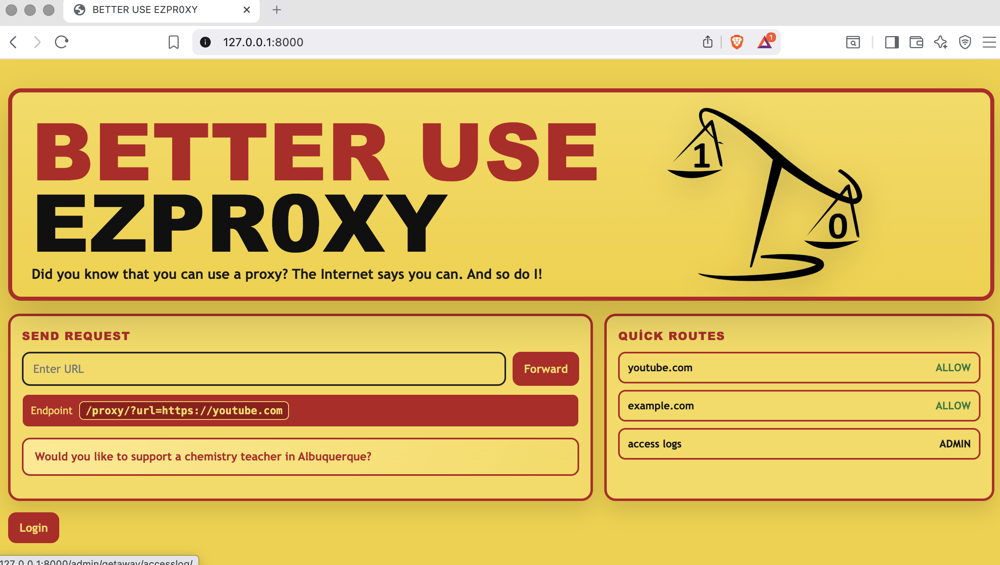
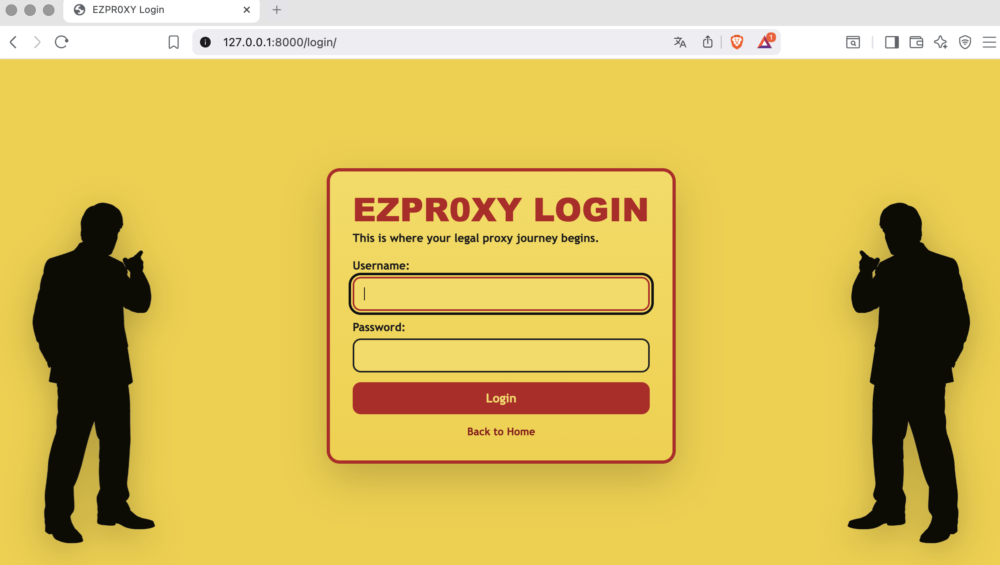
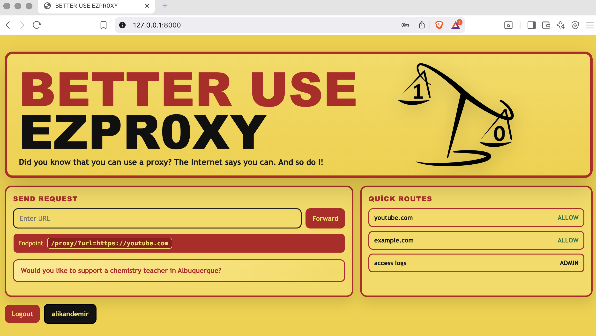
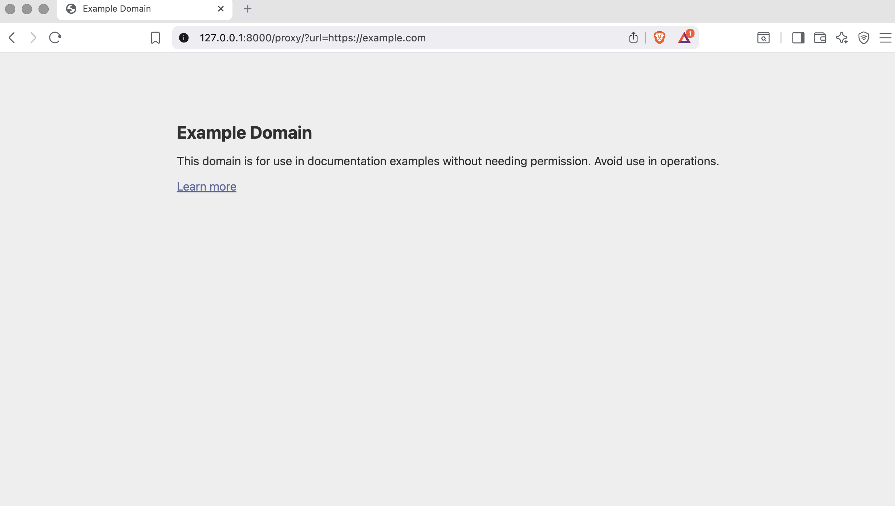

# EZPROXY (Local)

EZPROXY is a local-first Django proxy app for testing and browsing target URLs through a single `/proxy` endpoint.

## Stack
- Django
- Requests
- SQLite

## Features
- Login-protected proxy access
- URL forwarding via `/proxy/?url=...`
- Quick routes on home page
- Access log tracking in Django admin

## Screenshots





## Run Locally
```bash
cd proxyapp
python manage.py migrate
python manage.py createsuperuser
python manage.py runserver 127.0.0.1:8000
```

Open `http://127.0.0.1:8000`.
